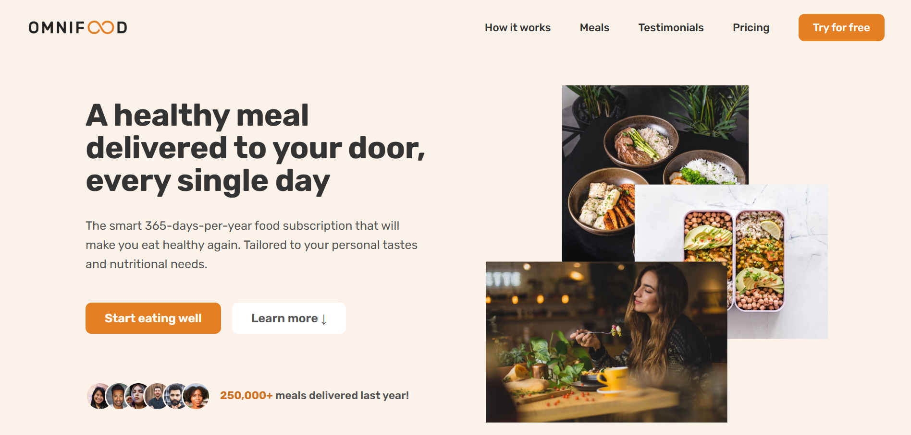

# 🍽️ Omnifood

**A healthy meal delivered to your door, every single day.**

Omnifood is a responsive landing page for an AI-powered food subscription service. Built with pure HTML, CSS, and JavaScript — no frameworks, no dependencies.

🌐 **Live Demo:** [www.omnifood-ri.netlify.app](https://omnifood-ri.netlify.app)

---

## 📸 Preview



---

## ✨ Features

- **Fully responsive** — works on all screen sizes (mobile, tablet, desktop)
- **Sticky navigation** — powered by the Intersection Observer API
- **Smooth scrolling** — seamless anchor navigation throughout the page
- **Mobile hamburger menu** — animated toggle for small screens
- **Safari flexbox fix** — polyfill for older Safari versions missing `gap` support
- **PWA-ready** — includes a `manifest.webmanifest` for installability

---

## 🗂️ Project Structure

```
Omnifood/
├── index.html
├── manifest.webmanifest
├── css/
│   ├── general.css       # Base resets & reusable utility classes
│   ├── styles.css        # Component & section styles
│   └── queries.css       # Media queries (responsive breakpoints)
├── js/
│   └── script.js         # Navigation, smooth scroll, sticky nav
└── img/                  # All images and icons
```

---

## 🛠️ Built With

| Technology                | Purpose                          |
| ------------------------- | -------------------------------- |
| HTML5                     | Semantic page structure          |
| CSS3                      | Flexbox, Grid, custom properties |
| JavaScript (ES6+)         | Interactivity & DOM manipulation |
| Intersection Observer API | Sticky navigation trigger        |

---

## 📄 License

This project is licensed under the MIT License.
